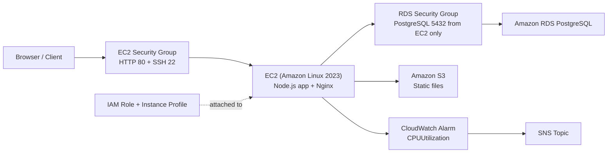

# Cloud Web App on EC2 + RDS + S3 + CloudWatch

This repository now includes a small Node.js web API plus Terraform infrastructure to deploy it on AWS with:

- `EC2` for the application server
- `RDS PostgreSQL` for application data
- `S3` for static HTML assets
- `CloudWatch` for CPU monitoring
- `IAM` for instance access to S3, SSM, and CloudWatch

## Architecture



Expanded notes live in [docs/architecture.md](docs/architecture.md).

## App Features

- `GET /health` returns API, S3, and database status.
- `GET /api/entries` reads recent guestbook entries from PostgreSQL.
- `POST /api/entries` writes a guestbook entry to PostgreSQL.
- `GET /api/files` lists S3 objects from the configured static bucket.
- `POST /api/files` uploads content into S3 and returns the resulting URL when available.

## Local Run

Set the environment variables from [.env.example](.env.example), then install and start the app:

```powershell
npm install
npm start
```

The API listens on `http://localhost:3000`.

## Terraform Deployment

Infrastructure lives in [infra/terraform](infra/terraform).

1. Copy `infra/terraform/terraform.tfvars.example` to `infra/terraform/terraform.tfvars`.
2. Set `app_repo_url` to your GitHub repository and provide a strong `db_password`.
3. Initialize and apply:

```powershell
cd infra/terraform
terraform init
terraform apply
```

Terraform provisions:

- a VPC with public and private subnets
- an EC2 instance in a public subnet
- security groups for EC2 and RDS
- an IAM role and instance profile for EC2
- a PostgreSQL RDS instance in private subnets
- an S3 bucket for static files
- an SNS topic and a CloudWatch CPU alarm

## Static Files on S3

The EC2 bootstrap script syncs repo-root `*.html` files to S3 automatically. You can also republish static files manually with [scripts/publish-static.ps1](scripts/publish-static.ps1):

```powershell
./scripts/publish-static.ps1 -Bucket your-bucket-name -Region us-east-1
```

## Notes

- The RDS security group only accepts PostgreSQL traffic from the EC2 security group.
- The EC2 instance is assigned an IAM role instead of relying on long-lived AWS keys.
- The CloudWatch alarm watches `AWS/EC2` `CPUUtilization` and publishes to SNS when it breaches the configured threshold.
- Provisioning still requires your own AWS credentials and a reachable GitHub repository URL.
