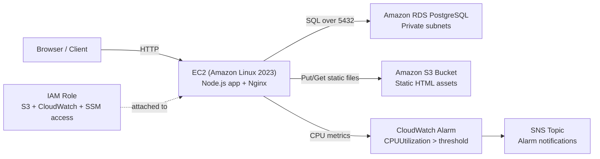

# AWS Deployment Architecture

## Overview

This project deploys a Node.js web application to Amazon EC2, connects it to a PostgreSQL database on Amazon RDS, stores static HTML assets in Amazon S3, and monitors instance CPU with Amazon CloudWatch.

## Architecture Diagram

## Resource Responsibilities

- `EC2`: runs the Node.js API and Nginx reverse proxy.
- `Security Groups`: expose HTTP and SSH to EC2, while allowing PostgreSQL only from the EC2 security group to RDS.
- `IAM Role`: lets the instance read and write static assets in S3 and supports CloudWatch/SSM integrations.
- `RDS`: stores guestbook-style application data used by `/api/entries`.
- `S3`: stores static site files like `index.html` and other portfolio pages.
- `CloudWatch Alarm`: alerts when CPU utilization stays above the configured threshold.

## Deployment Flow

1. Terraform creates networking, security groups, IAM, S3, RDS, SNS, EC2, and the CPU alarm.
2. EC2 user data installs Node.js, Nginx, AWS CLI, and the app from your GitHub repo.
3. The instance writes environment variables for S3 and RDS into a systemd-managed service.
4. HTML files in the repo root are synced to S3 during instance bootstrap.
5. The Node app serves the API on EC2 and reads/writes dynamic data from RDS.
